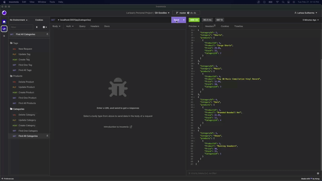
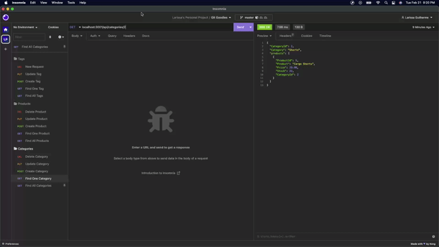
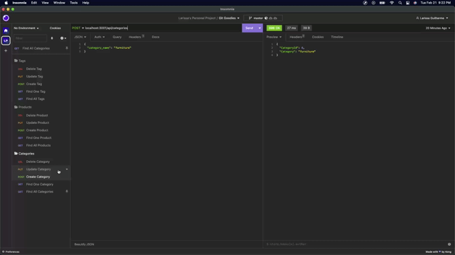

<h1 align="center"> Git Goodies </h1>

<p align="center">
    
  <br><br>
  <i> E-Commerce
    <br> built using Node.js and MySQL</i>
  <br>
</p>
<br>

<div align="center">


</div>

---

## Description

Git Goodies is a back end app for the e-commerce website that uses the latest technologies to be able to provide a suite of services to businesses of all sizes.

## Table of Contents

- [Description](#description)
- [Table of Contents](#table-of-contents)
- [Installation](#installation)
  - [Cloning the Repository](#cloning-the-repository)
  - [Prerequisites](#prerequisites)
  - [Setting Up](#setting-up)
- [Mock-Up](#mock-up)
- [Usage](#usage)
- [Tests](#tests)
  - [Prerequisites](#prerequisites-1)
  - [Running Tests](#running-tests)
- [Questions](#questions)
- [Contributing](#contributing)
  - [Contributing Guidelines](#contributing-guidelines)
  - [Code of Conduct](#code-of-conduct)
- [Credits](#credits)
  - [Acknowledgements](#acknowledgements)
  - [Links](#links)
- [License](#license)

## Installation

### Cloning the Repository

Click `<> code` - the green button. After clicking, in the local tab, copy the SSH key. Open the terminal in your Macbook or [git bash](https://git-scm.com/downloads), if you have Windows/Linux, and type:

```bash
git clone [paste ssh key]
```

I would recommend downloading [Visual Studio Code](https://code.visualstudio.com/download) to edit the code locally. If you need more information on how to clone a repository, [click here](https://docs.github.com/en/repositories/creating-and-managing-repositories/cloning-a-repository)!

### Prerequisites

This package requires you to have [Node.js](https://nodejs.org/en/download/), npm, Inquirer, [Express.js](https://expressjs.com/) and [MySQL2](https://www.npmjs.com/package/mysql2) installed on your machine. You can install these by running the code below on your terminal:

For `npm`

```bash
curl -o- https://raw.githubusercontent.com/nvm-sh/nvm/v0.39.3/install.sh | bash
```

For `Node.js`

```bash
npm i node@lts
```

For `Express.js`

```bash
npm i express
```

### Setting Up

Open the project in VS Code and make sure you are in the directory of this application before installing `MySQL2`, `dotenv` and `Sequelize`. To install it, type the commands below on your terminal:

For `MySQL2`

```bash
npm i mysql2
```

For `dotenv`

```bash
npm i dotenv
```

For `Sequelize`

```bash
npm i sequelize
```

You can also open the project in VS Code, make sure you are in the directory of this application and then type the command below on your terminal:

```bash
npm i
```

Once you run this, npm will begin the installation process of all of the current project's dependencies.

## Mock-Up

The following image is an illustration of the schema of the existing tables in the database of this application:


## Usage

First you need to seed the database using the command:

```bash
npm run seed
```

Then launch the application by entering the command below on your terminal:

```bash
npm start
```

Once the application is launched, GIVEN a functional Express.js API
WHEN I add my database name, MySQL username, and MySQL password to an environment variable file
THEN I am able to connect to a database using Sequelize
WHEN I enter schema and seed commands
THEN a development database is created and is seeded with test data
WHEN I enter the command to invoke the application
THEN my server is started and the Sequelize models are synced to the MySQL database
WHEN I open API GET routes in Insomnia for categories, products, or tags
THEN the data for each of these routes is displayed in a formatted JSON
WHEN I test API POST, PUT, and DELETE routes in Insomnia
THEN I am able to successfully create, update, and delete data in my database

If you need more guidance on how to use Git Goodies, click [here]() for the tutorial!

## Tests

### Prerequisites

To test this application, you will need to install [Postman API](https://www.postman.com/downloads/) or [Insomnia](https://insomnia.rest/download).

### Running Tests

Open your terminal, make sure you are in the directory of this application and type the command below to seed data to the database so that you can test the routes.

```bash
npm run seed
```

The following animation shows the application's **GET** routes to return all categories, all products, and all tags being tested in Insomnia:



The following animation shows the application's **GET** routes to return a single category, a single product, and a single tag being tested in Insomnia:



The following animation shows the application's **POST, PUT, and DELETE** routes for categories being tested in Insomnia:



## Questions

For questions and support feel free to contact me via:

<a href="mailto:larigens@gmail.com">📧 Email </a>

<a href="https://github.com/larigens">🐈‍⬛ GitHub </a>

## Contributing

### Contributing Guidelines

Want to report a bug, contribute some code, request a new feature, or improve the documentation? You can submit an issue and I will gladly welcome you as a contributor, but before submitting an issue, please search the issue tracker, as it may already exist!

### Code of Conduct

Our Code of Conduct follows the same principles as the [Contributor Covenant](https://www.contributor-covenant.org/version/2/1/code_of_conduct/), version 2.1.

## Credits

### Acknowledgements

- [W3 Schools](https://www.w3schools.com)
- [MDN](https://developer.mozilla.org/en-US/)
- [Node.js](https://nodejs.org/en/)
- [NPM](https://www.npmjs.com/)
- [README Lab](https://github.com/larigens/readme-lab)
- [Express.js](https://expressjs.com/en/4x/api.html)
- [MySQL](https://dev.mysql.com/doc/)
- [MySQL2](https://www.npmjs.com/package/mysql2)
- [Stack Overflow](https://stackoverflow.com/)
- [dotenv](https://www.npmjs.com/package/dotenv)
- [Sequelize](https://www.npmjs.com/package/sequelize)
- [bcrypt](https://www.npmjs.com/package/bcrypt)
- [Postman API](https://www.postman.com/)
- [Insomnia](https://insomnia.rest/)

### Links

[](https://larigens.github.io/lari-gui/)
[](https://www.linkedin.com/in/lari-gui/)
[](https://twitter.com/coffeebr_eak)

## License

Please refer to the [LICENSE](https://choosealicense.com/licenses/apache-2.0/) in the repo.
